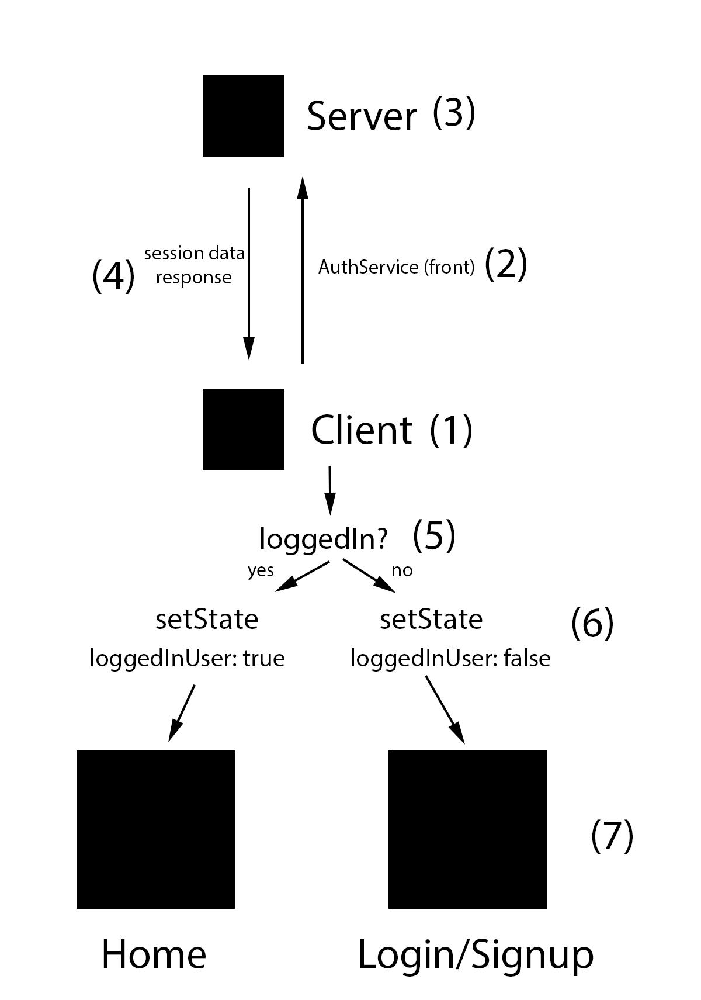

Don't forget to:

1) Install dependencies both in server and front via `npm install`
2) In the server section add a file called `.env` with these environment variables:

~~~~
DBURL=mongodb://localhost:27017/reactAuthentication  
PORT=3010
~~~~

3) Then run the server and the front!

This is the main idea behind the front end logic

